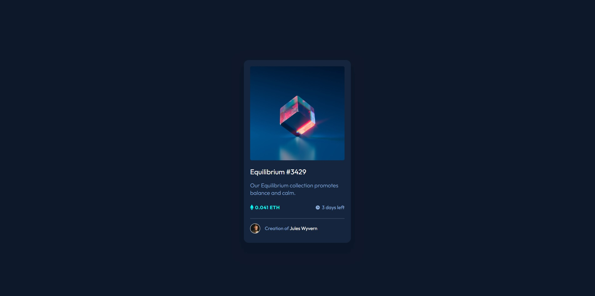

# Frontend Mentor - NFT preview card component solution

This is a solution to the [NFT preview card component challenge on Frontend Mentor](https://www.frontendmentor.io/challenges/nft-preview-card-component-SbdUL_w0U). Frontend Mentor challenges help you improve your coding skills by building realistic projects. 

## Table of contents

- [Overview](#overview)
  - [The challenge](#the-challenge)
  - [Screenshot](#screenshot)
  - [Links](#links)
- [My process](#my-process)
  - [Built with](#built-with)
  - [What I learned](#what-i-learned)
  - [Continued development](#continued-development)
- [Author](#author)

## Overview

### The challenge

Users should be able to:

- View the optimal layout depending on their device's screen size
- See hover states for interactive elements

### Screenshot

### Links

- Solution URL: [(https://github.com/GSD3v08/ntf-preview-card](https://github.com/GSD3v08/ntf-preview-card)
- Live Site URL: [https://gsd3v08.github.io/ntf-preview-card/](https://gsd3v08.github.io/ntf-preview-card/)

## My process

### Built with

- Semantic HTML5 markup
- CSS custom properties
- Flexbox
- Desktop-first workflow

### What I learned

I think shadows was the part more dificult in this project, making multiple shadows was a little confusing at first, it is not perfect but I think the result was good.
The overlay background was something new that I learned to do in this challenge but it was something fun to do.

### Continued development

I want to focus how properly use unit like px, em, rem, etc., and try to learn more about responsive. 

## Author

- Frontend Mentor - [@GSD3v08](https://www.frontendmentor.io/profile/GSD3v08)

